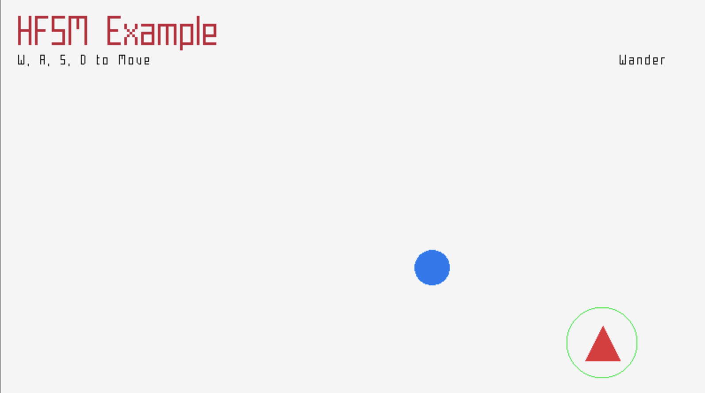

-----------------------------------

Welcome to **Hierarchical Finite State Machine (HFSM) example**!

This example provides a worked example in c++ of how a hierarchical finite state machine might work. 


The repo built on the Raylib ([template example](https://github.com/raysan5/raylib-game-template)). Therefore it is also pre-configured with a default `LICENSE` (zlib/libpng) and a `README.md` (this one) to be properly filled by users. Feel free to change the LICENSE as required.


This template has been created to be used with raylib (www.raylib.com) and it's licensed under an unmodified zlib/libpng license.
_Copyright (c) 2014-2025 Ramon Santamaria ([@raysan5](https://twitter.com/raysan5))_

The HFSM project is built by mr_J05H (jhall.develop)

Run the project locally
cd into the root directory of ./docs folder
Run the command 
python -m http.server 8080

or upload to your own webserver 


-----------------------------------

# C++ Hierarchical Finite State Machine (HFSM) Example

This project provides a practical C++ example of a Hierarchical Finite State Machine (HFSM) using the raylib library. It demonstrates how AI states can be nested and managed for game characters.



This project is built upon the [raylib game template](https://github.com/raysan5/raylib-game-template).

---

## Features

* A simple **HFSM** implementation (`src/AI/AI_HFSM.cpp`) managing parent and child states.
* **AI States** include:
    * `Wander_State`
    * `Attack_State` (parent state)
        * `Seek_State`
        * `Shoot_State`
        * `Reload_State`
* A basic `Pawn` class that inherits from an `Actor` base class.

---

## Controls

* **Move Player:** `W`, `A`, `S`, `D`

---

## Getting Started

### 1. Prerequisites: Setup Raylib

Before you begin, you **must** have the raylib library set up and working correctly.

1.  Clone the [raylib repository](https://github.com/raysan5/raylib.git).
2.  Follow its instructions to build the library for your target platform.
3.  Ensure you can compile and run one of the standard raylib examples before proceeding.
4.  Update the `Makefile` in this project to point to your local raylib source path.

### 2. Build the Project

This project uses a `Makefile` to simplify compilation. Navigate to the project's root directory in your terminal and run one of the following commands.

**Build for Web (HTML5)**

```bash
make PLATFORM=PLATFORM_WEB BUILD_WEB_RESOURCES=TRUE -B -e
```

**Build for Desktop**

```bash
make PLATFORM=PLATFORM_DESKTOP -B -e
```

> **Note:** The `-B` flag forces a complete rebuild of all files, which is useful to ensure a clean build. The `-e` flag allows environment variables to override Makefile variables.

---

## Running the Web Build Locally

After building for the web, a `.html` file will be created. You can run it locally using a simple web server.

1.  Navigate into the project's root directory.
2.  Run the command:
    ```bash
    python -m http.server 8080
    ```
3.  Open your web browser and go to `http://localhost:8080/your_game.html`.

---

## License & Credits

This project is licensed under an unmodified zlib/libpng license. See the [LICENSE](LICENSE) file for details.

* **HFSM Project:** mr\_J05H (jhall.develop)
* **Original raylib Template:** Ramon Santamaria ([@raysan5](https://twitter.com/raysan5))

*Copyright © 2025 jhall.develop*

